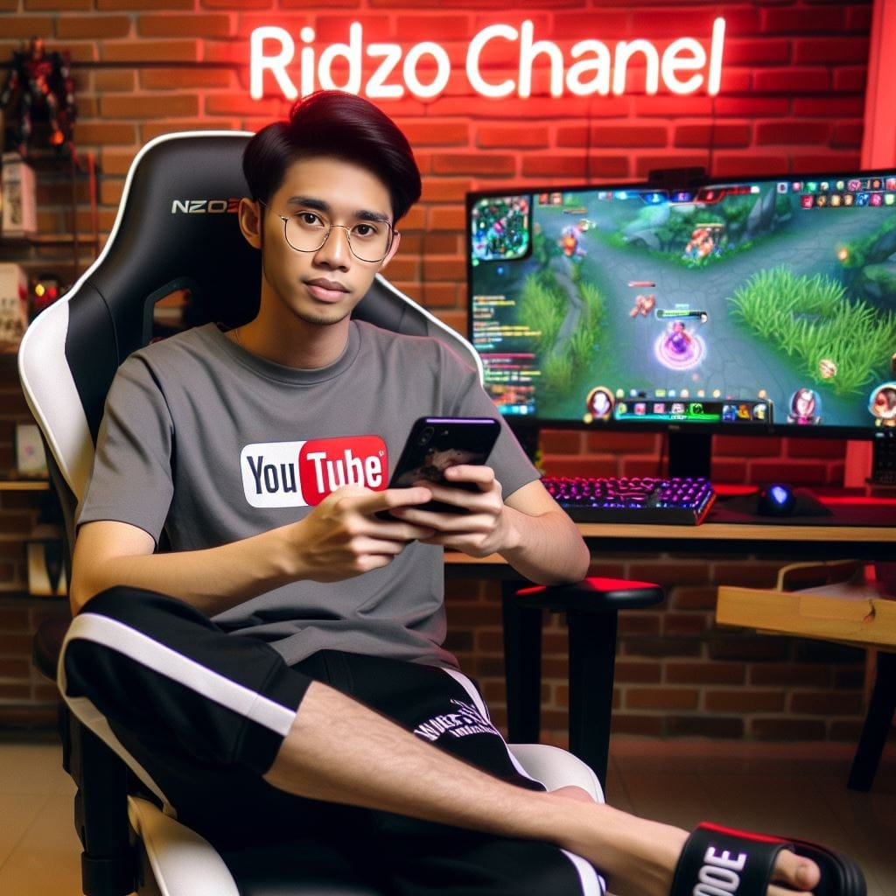

## Welcome to LARASKY 
---
> SKY HAS NO LIMIT


# $\fbox{\color{red}⩇⩇:⩇⩇  \ \color{blue}Larasky  \ Gallery}$ 

**Larasky Gallery** is a collection of AI image prompts for learning purposes.

## About

**Larasky Gallery** is a dynamic repository that provides a curated set of AI image prompts. These prompts are designed to facilitate learning and experimentation in the field of artificial intelligence.

## Features

- Curated AI Image Prompts
- Daily Updates

## Usage

Explore the diverse set of prompts in the Larasky Gallery to inspire your AI projects and enhance your creative thinking.


## Table of Prompts
- [Stable Diffusion](#fboxcolorred𝟙---colorbluestablediffusion)
- [DreamShaper](#fboxcolorred𝟚---colorbluedreamshaper)
- [Midjourney](#fboxcolorred𝟛---colorbluemidjourney)
- [Dall-E](#fboxcolorred𝟜---colorbluedall-e)
- [Essential AI](#fboxcolorred𝟝---colorblueessentialai)


# $$\fbox{\color{red}⩇⩇:⩇𝟙  \ \color{blue}StableDiffusion}$$ 

## Overview

**Stable Diffusion** is a deep learning model designed for text-to-image generation. Released in 2022, this model leverages diffusion techniques to generate high-quality images from textual descriptions.
[Stable Diffusion Online](https://stablediffusionweb.com/)

## Features

- **Text-to-Image Generation:** Stable Diffusion excels in generating realistic images from textual prompts.

- **Diffusion Techniques:** The model is built on diffusion techniques, a method that aids in the generation of coherent and high-fidelity images.

## Image Prompt Example
<details>
  
<details>
<summary>Stable Diffusion portraits prompts <b>Beautiful Woman White Hair</b></summary>


```console
Beautiful woman white hair and long look at camera sad with a tear, UHD, 8K, high resolution, oil painting, hyper realims, face detail, perfect face, background forest, 16k, UHD, HDR,(Masterpiece:1.5), (best quality:1.5), RAW candid cinema, studio, 16mm, ((color graded portra 400 film)) ((remarkable color)), (ultra realistic), textured skin, remarkable detailed pupils, ((realistic dull skin noise)), ((visible skin detail)), ((skin fuzz)), (dry skin) shot with cinematic camera,
```

</details>
</td></tr>

<details>
<summary>Stable Diffusion portraits prompts <b>Masterpiece</b></summary>


```console
masterpiece, best quality, 1girl, solo, (loli, child), blue hair, ponytail hair, [pink|blue] eyes, white theme, blue theme, white T-shirt, shorts, medium breast, navel, (sky, sunlight, ocean, from below:1.36), standing, cowboy shot, <lora:add_detail:1>, 8k, UHD, HDR,(Masterpiece:1.5), (best quality:1.5)
```

</details>
</td></tr>

<details>
<summary>Stable Diffusion concept art prompts <small>XL Base 0.9</small> <b>Masterpiece</b></summary>


```console
Masterpiece, Best Quality, Masterpiece, Best Quality, Masterpiece, Best Quality, Masterpiece, Best Quality, Masterpiece, Best Quality, Masterpiece, Best Quality, portrait of a teenage girl, (triadic palette:1.2)
```

</details>
</td></tr>

<details>
<summary>Stable Diffusion photography <b>Colorful Woman</b></summary>


```console
Frontal portrait of a whimsical and colorful woman resembling a mermaid or siren. Fair complexion, youthful features, wide open eyes, and delicate freckles on nose and cheeks. Vibrant, gravity-defying hair in shades of purple, blue, orange, and teal. Hair transitions into tendrils or aquatic flora, creating an underwater illusion. Small bubbles floating around the head add to the underwater theme. Attire or visible body part resembles teal and green fish scales with vibrant colors. Overall effect: Serene and otherworldly underwater creature in quiet contemplation.
```

</details>
</td></tr>

<details>
<summary>RealCartoonXL v6 <b>Bermain di atas lahan sawah</b></summary>


```console
foto realistis, anak kecil indonesia umur 6 tahun sedang bermain di atas lahan sawah yang berlumpur sambil memegang kodok di telapak kedua tangan nya menjulurkan ke kamera sambil tersenyum di hasil foto hp samsung 21 ultra effect auto fokus cinematik, 360 latar belakang persawahan langit dan awan gambar ultra HD,sangat detail ,photogrphy style pojok samping kiri sangat nyata color HD contras HD,kualitas HD
```

</details>
</td></tr>


</details>


# $$\fbox{\color{red}⩇⩇:⩇𝟚  \ \color{blue}DreamShaper}$$ 

## Overview

**DreamShaper** is a highly specialized image generation AI model created by AI community user Lykon. Leveraging advanced techniques such as Safetensors and Checkpoint AI, DreamShaper is designed to excel in generating high-quality and unique images based on specific inputs.

## Features

- **Specialization:** DreamShaper is tailored for image generation tasks, providing a unique blend of creativity and precision.

- **Safetensors Integration:** The model incorporates Safetensors, ensuring robust and safe operation during the generation process.

- **Checkpoint AI Model:** DreamShaper utilizes a checkpoint AI model, allowing users to save and resume the generation process at specific points.

## Usage

### Installation

To use DreamShaper, follow these steps:

```bash
# Clone the DreamShaper repository
git clone https://github.com/lykon/dreamshaper.git

# Navigate to the project directory
cd dreamshaper

# Install dependencies
pip install -r requirements.txt
```

## Image Prompt Examples

<details>

<details>
<summary>DreamShaper <b>Wedding Invite</b></summary>


```console
wedding invite acceptance , for Bissan and Omar, purple and white water color background, canvas background ,high-resolution, modern 8k, photorealistic, Graphic design illustration, vector style, do not crop with edges of art
```

</details>
</td></tr>


</details>


# $$\fbox{\color{red}⩇⩇:⩇𝟛  \ \color{blue}MidJourney}$$ 

## Overview

**MidJourney** is a research laboratory that focuses on expanding the creative abilities of humanity through exploring new forms of thought.
[MidJourney AI Explore Page](https://www.midjourney.com/explore)

## Image Prompt Examples

<details>

<details>
<summary>Midjourney portraits <b>Colorful Outfit</b></summary>


```console
the blue beauty dressed in a very colorful outfit, in the style of brandon woelfel, becky cloonan, uhd image, light red and red, luminescent lightscapes, tanya shatseva, close up, Fujifilm X-T4, Sony FE 85mm f/1. 4 GM --ar 45:56 --q 2 --s 750 --style raw --v 5.1
```

</details>
</td></tr>

<details>
<summary>Midjourney photograph <b>bluedress woman</b></summary>


```console
the woman is in a blue dress, in the style of neon and fluorescent light, zbrush, undulating lines, shallow depth of field, 3d, nicolas delort, light silver and turquoise Fujifilm X-T4, Sony FE 85mm f/1. 4 GM --ar 51:91 --style raw --s 750 --v 5.1
```

</details>
</td></tr>

<details>
<summary>Midjourney Niji Mode <b>Chinese Woman</b></summary>


```console
chinese woman dressed in oriental with a candle, in the style of dark orange and gold, romantic depictions of historical events, fairycore, webcam photography, historical reproductions, traditional techniques reimagined, made of flowers --ar 2:3 --niji 5
```

</details>
</td></tr>

<details>
<summary>Midjourney <b>Futuristic T-Shirt</b></summary>


```console
incredible futuristic t-shirt design, neon tribal pattern, post-processing, de-noise, ultra realistic, unreal engine --w 1080 --h 1920 --q 2 --s 5000
```

</details>
</td></tr>


</details>


# $$\fbox{\color{red}⩇⩇:⩇𝟜  \ \color{blue}DALL-E}$$ 

## Overview

**DALL·E**, developed by OpenAI, is an advanced AI model that extends the capabilities of its predecessor, DALL·E. It specializes in generating high-quality images based on textual descriptions provided to it in natural language.

## Features

- **Image Generation:** DALL·E 2 excels in generating images from textual prompts, allowing users to describe scenes, objects, or concepts, and the model produces corresponding images.

- **Creative Art:** The system is not limited to realistic depictions but can also create imaginative and abstract art based on textual input.

- **Natural Language Interface:** Users can interact with DALL·E 2 using natural language, making it accessible for a wide range of creative applications.

## Getting Started

To get started with DALL-E 2, visit the official [documentation](https://docs.openai.com/dall-e-2).


## Image Prompt Example

<details>

<details>
<summary>ChatGPT <b>Curiculum Vitae</b></summary>


```console
Craft a mockup-scenery for a technical, modern premium and professional Curriculum Vitae (CV). Mixed multi-column template in a modern layout. High-resolution, modern geometric layout, teal and white color scheme, header with name and contact, sections for summary, skills, experience, education, achievements, readable fonts, skill infographics, clean background with color blend, presented on wooden surface, white pen accessory, emphasis on content clarity and professionalism. Laying on a tavble made in birch.
```

</details>
</td></tr>

<details>
<summary>DALL-E <b>Scotter Matic</b></summary>


```console
a scooter matic motorcycle 2 rear shockbreaker, strong dark black gold yellow black strong color, strong style, complicated, aerodynamic symmentrical, propotionate, side view, mysterious
```

</details>
</td></tr>

<details>
<summary>DALL-E <b>Purwokerto</b></summary>


```console
The art of typographic writing: "ORA NGAPAK - ORA KEPENAK"  Style: typography, clearly legible and organized letters. Effect: leaf ornament, ribbon, colorful. Background: White billboard on the roadside of Purwokerto city.
```

</details>
</td></tr>

<details>
<summary>DALL-E <b>Realistic riding with girl</b></summary>


```console
foto realistis, lelaki Indonesia muda berboncengan dengan wanita berhijab berpegangan, jalan beraspal sepeda motor Sport biru dengan plat nomor "E 2567 ZM", background pegunungan, gambar realistis detail full ultra Hd
```

</details>
</td></tr>

<details>
<summary>DALL-E <b>Karikatur riding with girl</b></summary>


```console
foto karikatur, lelaki Indonesia muda berboncengan dengan wanita berhijab berpegangan perut lelaki bawa sayur belanja di jalan beraspal sepeda motor lawas warna merah putih dengan plat nomor "E 2567 ZM", background pegunungan, gambar realistis detail full ultra Hd
```

</details>
</td></tr>

<details>
<summary>DALL-E <b>Playing Twitter</b></summary>


```console
Create animated 3d art,a little boy,messy hair, wearing Arsenal jacket sobek sobek,white shoes,sitting on yellow gaming chair and playing the twitter social media page with a blue glowing hologram,there are several other cool holographic tools, futuristic, technology,hd 8k,5d animasi
```

</details>
</td></tr>

<details>
<summary>DALL-E <b>Youtube Channel</b></summary>



```console
seorang pria indonesia berusia 25 tahun rambut hitam pendek rapih memakai baju bola real madrid, berbadan kurus, kulit sawo matang, celana kolor pendek warna hitam, duduk di kursi gaming sambil memegang HP menghadap ke depan. ada komputer sedang bermain game mobile legend di atas meja di sampingnya. latar belakang di dalam kamar YouTube. ada lampu neon yang membentuk tulisan "Nama Anda" gambar realistik
```

</details>
</td></tr>

<details>
<summary>DALL-E <b>Karikatur Santosa</b></summary>


```console
Foto karikatur 3D seorang laki laki umur 52 tahun Indonesia berambut pendek, berjanggut pendek,berkumis hitam campur putih, mengenakan tshirt bergaris warna merah dan putih bertuliskan "santosa", memakai ikat kepala warna hitam bercorak putih, memakai celana besar panjang setengah lutut, melingkar ikat pinggang dipinggangnya
berdiri tegap , badan agak gemuk, latar belakang warna aurora dengan skema warna hitam dan emas, , detail full ultra HD. Gunakan penyaji RenderMan.
```

</details>
</td></tr>

<details>
<summary>DALL-E <b>Whatsapp Profile</b></summary>


```console
Create a 3d illustration of a realistic [GENRE] character sitting relaxed on top of the social media logo "whatsapp". Characters should wear casual modern clothing, a jeans, jacket, and sneaker. The background of the image is a social media profile page with name [NAME]
```

</details>
</td></tr>

<details>
<summary>DALL-E <b>Gamer New Year</b></summary>


```console
Seorang lelaki Indonesia berumur 60 Tahun duduk di kursi gaming, sambil merokok, memakai jaket warna pink, di dalam kamar ada sebuah komputer, dan background layar tulisan "FIRST ID", latar belakang hitam dengan lampu neon bertuliskan "Happy New Year 2024". Gambar sangat realistik nyata. Ultra HD, 8k. Hasil photographer profesional. Full shot image. Detail sangat rumit.
```

</details>
</td></tr>

<details>
<summary>DALL-E <b>Couple New Year</b></summary>


```console
merayakan pergantian tahun.suami dewasa indonesia memakai kemeja putih,jaket kulit hitam,celana hitam sepatu kulit.istri perempuan dewasa indonesia memakai hijab mengenakan gaun yang anggun warna hitam paduan emas.cipratan warna warni kembang api bertuliskan "HAPPY NEW YEAR 2024".latar belakang suasana malam hari yang ramai dipadati warga,cerah dan penuh warna warni lampu.penuh kecerian, canda.terlihat nyata.realistis.detail rumit dan tajam.potret 105mm,F2.8.
```

</details>
</td></tr>


<details>
<summary>DALL-E <b>Larasky Universe</b></summary>


```console
gambar 4D realistis, seorang gadis cantik Indonesia dengan rambut sebahu, berwarna putih, view dari arah atas memakai kaos bertuliskan "LARASKY". sedang berdiri diatas bumi bulat yang tidak terlalu kecil. suasana objek sekitar menggambarkan galaksi Bimasakti dan hiasannya tata Surya. gambar sangat HD, detail rumit, hasil photography profesional.
```

</details>
</td></tr>

<details>
<summary>DALL-E <b>Spiderman from future</b></summary>


```console
anak 4 tahun Indonesia, memakai pakaian casual, celana jeans, wajah tersenyum, sedang selfie bersama spiderman, kostum futuristik dengan teknologi robotik,semua mata tertuju padanya, background persawahan, detail rumit, hasil photographer, 8k
```

</details>
</td></tr>


<details>
<summary>DALL-E <b>Giant Gundam</b></summary>


```console
giant gundam wing zero fighting ,location richly illustrated, denoise, insanely detailed metal parts, realisticly colored, cinematic lights and 8k virtual efects. Ultrarealistic, 3D hyper photorealistic
```

</details>
</td></tr>


<details>
<summary>DALL-E <b>Larasky gold paint</b></summary>


```console
create a 3d image with text "Larasky", in pearl white colored letters, with an asian hand with gold nails holding a paint brush. The background should have a spill of gold glitter in one corner setup on a rose gold airbrushed background
```

</details>
</td></tr>


<details>
<summary>DALL-E <b>Larasky PUBG</b></summary>


```console
Create a hyper realistic illustration a 25 year old Indonesian woman wearing a Yellow, Black Larasky hoodie suit and puma shoes jumping out of an android Mobile playing the Pubg Mobile game PUBG : BATTLEGROUNDS The background Of The Image Showcase Pubg Battlegrounds in full 32K UHD glossy.
```

</details>
</td></tr>


<details>
<summary>DALL-E <b>Larasky Smoke</b></summary>


```console
ultra realistic Indonesian blue eyed woman with ripped jeans and a hoodie with gold name "Larasky", smoking MaryJane sitting at the edge of the universe
```

</details>
</td></tr>


<details>
<summary>DALL-E <b>I'm Larasky</b></summary>


```console
cinematic powerful Indonesian woman, white skin, white hair, giant hoop earrings, gold bangles, in clean blue corridor with metallic copper panels on walls, glass filled with champagne, machete in hand, wearing purple crop top that says "I'M LARASKY" with chains belt, purple silk pants, teal lipstick, teal dreadlocks, raging flames on candles in background, hyper realism
```

</details>
</td></tr>


<details>
<summary>DALL-E <b>Samurai Lara</b></summary>


```console
Portrait of a 3D Chinese woman with long black hair with a ponytail hairstyle. a sword beside her. The character wears a black hoodie and skirt. The background of a 3d dragon in neon blue yellow pink colors
```

</details>
</td></tr>

<details>
<summary>DALL-E <b>Realistic Girl</b></summary>


```console
a 20 year old girl, of indonesian ethnicity, white hair, dressed in simple clothes, her face full sweat and slighty blue, due to the cold, sitting outside the house, heavy rain around her. expression of suffering from cold while shivering. The film was shot with the best camera in the world, ultra HD, 16k, super detailed, extreme realistic.
```

</details>
</td></tr>


</details>


# $$\fbox{\color{red}⩇⩇:⩇𝟝  \ \color{blue}EssentialAI}$$ 


## Image Prompt Example

<details>

<details>
<summary>Essential v1 <b>Indonesian young girl</b></summary>


```console
3D caricature photo of an Indonesian young girl wearing hijab no hair, wearing a jacket that says "LARASKY", riding a of DUCATI sleek and modern with black and gold color scheme, displaying its right side. The motorcycle has thick tires with gold rims, a dark body with gold stripes and accents, and an intricate suspension system painted gold, background on asphalt road, with a mountainous, realistic image, full ultra HD details. Use the RenderMan renderer.
```

</details>
</td></tr>

<details>
<summary>ChatGPT <b>Artistic Scene</b></summary>


```console
An imaginative and artistic scene of a fantasy world, with a vibrant landscape that includes floating islands, luminescent flora, and whimsical non-human creatures. The creatures are depicted as friendly and whimsical, engaged in peaceful activities that showcase their harmonious existence. Architectural structures with surreal designs dot the landscape, integrating seamlessly with the natural wonders. The atmosphere is filled with soft glows and bioluminescent lights, casting a magical radiance throughout the scene. The color palette is rich and diverse, featuring a range of vivid colors that add depth and vibrancy to the world. This enchanting scene is suitable for a storybook or a family-friendly fantasy film, designed to inspire wonder and captivate the imagination, free from any explicit or inappropriate content. robiness. masterprompter.
```

</details>
</td></tr>


</details>


## Contribution

Contributions are welcome! If you have interesting AI image prompts to share, please follow our [Contribution Guidelines](CONTRIBUTING.md).

## License

This project is licensed under the [MIT License](LICENSE).

---

Connect with us:
- [Twitter](https://twitter.com/)
- [LinkedIn](https://www.linkedin.com/company/)
- [Website](https://)

For issues or suggestions, please [create an issue](https://github.com/laraskyAI/larasky/issues).


